> *"I'd rather ship an imperfect product than perfect one that never ships."*

---

### 🧑‍💻 About Me

I'm an **AI & Data Science student at Amrita Vishwa Vidyapeetham**, and I like building things that either think for themselves or scale far beyond my laptop — sometimes both.

- 🏆 Won the **NitroStack Hackathon** — built and shipped something real under pressure
- 🤖 Exploring **Agentic AI** — systems that don't just respond, they act
- 💻 Full-stack development across **Python, React, and Next.js**
- ☁️ Getting hands-on with the cloud through **AWS**
- 🎯 Currently **open to internships** — always down to build something that matters

*Still evolving, like a certain fire-type — one build at a time. 🔥*

 

---

### 🛠️ Tech Stack

**Languages**

**Frontend**

**Cloud, Database & Tools**

---

### 📊 GitHub Stats

---

### 🐍 Contribution Snake

---

### 🌐 Connect with Me

---

<i>Thanks for visiting — ⭐ a repo of mine if you found something useful!</i>

